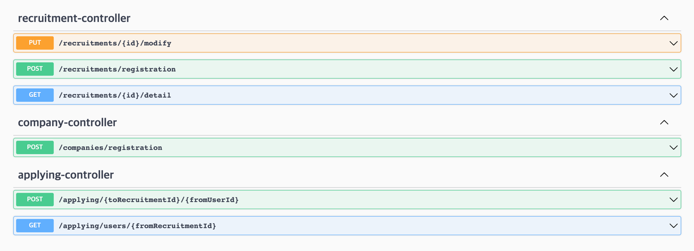
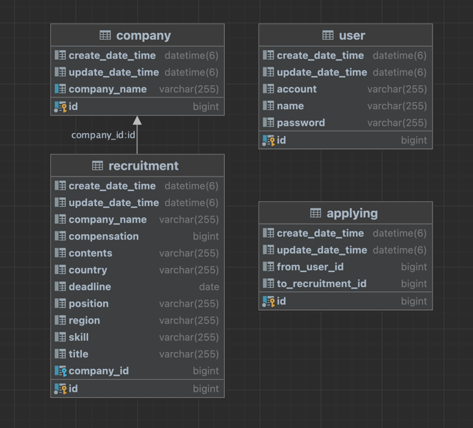

# wanted-pre-onboarding-backend
원티드 프리온보딩 백엔드 인턴쉽 사전과제

---

## 서버 사용 기술 스택

- 언어 : java
- 스킬 : springboot, mysql, jpa

---

## 기능 구현

- [x] 회사는 채용공고를 등록할 수 있다.
- [x] 회사는 채용공고내용을 수정할 수 있다.
- [x] 회사는 채용공고를 삭제할 수 있다.
- [x] 사용자는 채용공고에 지원할 수 있다.
- [x] 해당공고에 지원한 유저들을 볼 수 있다.
- [x] 사용자는 채용공고 목록을 볼 수 있다.
- [ ] 채용공고 검색기능을 제공한다.

---

## 요구사항

1. **채용공고를 등록합니다.**

    <aside>
    ➡️ 회사는 아래 데이터와 같이 채용공고를 등록합니다.
    </aside>
``` JSON
{
  "title": "string",
  "position": "string",
  "region": "string",
  "country": "string",
  "compensation": 0,
  "contents": "string",
  "skill": "string",
  "deadline": "2023-10-17"
}
```

2. **채용공고를 수정합니다.**
    <aside>
    ➡️ 회사는 아래 데이터와 같이 채용공고를 수정합니다.
    </aside>
``` JSON
{
  "companyId": 0,
  "title": "string",
  "position": "string",
  "region": "string",
  "country": "string",
  "compensation": 0,
  "contents": "string",
  "skill": "string",
  "deadline": "2023-10-17"
}
```
   
3. **채용공고를 삭제합니다.**

    <aside>
    ➡️ DB에서 삭제됩니다. 사용자가 해당 채용공고에 지원한 내용도 함께 삭제됩니다.
    </aside>

4. **채용공고 목록을 가져옵니다.**

    <aside>
    ➡️ 사용자는 채용공고 목록을 아래와 같이 확인할 수 있습니다.
    </aside>
``` JSON
[
  {
    "title": "자바개발자 구해요",
    "companyName": "채용디자인",
    "region": "서울",
    "country": "한국",
    "position": "웹 백엔드",
    "compensation": 1000000,
    "skill": "java",
    "deadline": "2023-10-20"
  },
  {
    "title": "자바개발자 구해요",
    "companyName": "채용디자인",
    "region": "서울",
    "country": "한국",
    "position": "웹 백엔드",
    "compensation": 1000000,
    "skill": "java",
    "deadline": "2023-10-20"
  },
 
  ...
]
```

5. **채용 상세 페이지를 가져옵니다.**

    <aside>
    ➡️ 사용자는 채용상세 페이지를 아래와 같이 확인할 수 있습니다.

   - “채용내용”이 추가적으로 담겨있음.
   - 해당 회사가 올린 다른 채용공고 가 추가적으로 포함됩니다
       </aside>

``` JSON
{
  "id": 11,
  "companyName": "채용디자인",
  "position": "웹 백엔드",
  "compensation": 1000000,
  "skill": "java",
  "deadline": "2023-10-20",
  "contents": "데브툴즈는 블록체인 기반 솔루션을 통해 탈중앙화된 금융/게임 DApps를 제공합니다.\n\n 블록체인 산업에서 부족한 '사용성'과 '확장성' 문제를 해결하려는 비전을 품고 있죠.\n자체 개발한 블록체인 메인넷을 기반으로 누구나 쉽게 탈중앙화 금융 및 게임 서비스를 즐길 수 있도록 산업을 혁신하고자 합니다.\n우리와 함께 새로운 web3 생태계를 확장해나갈 여러분을 기다립니다.",
  "otherRecruitmentIds": [
    2,
    3,
    4,
    5,
    6,
    7,
    8,
    9,
    10,
    11,
    12,
    13,
    14,
    15,
    16,
    17,
    18,
    19
  ]
}
```

6. **사용자는 채용공고에 지원합니다.**

    <aside>
    ➡️ 사용자는 채용공고에 아래와 같이 지원합니다.

   - 사용자는 1회만 지원 가능합니다.
       </aside>

``` 
url path = /applying/{toRecruitmentId}/{fromUserId}
```
---

## API 명세 (_OpenAPI 1.6.8_)



---

## ERD



---

## 회고

- 채용공고에 지원하기 기능을 구현하다가 보니 service 로직에서 사용자와 채용공고 사이의 강한 결합이 발생할 것 같았다.
  - 이를 해결하기위해 controller에서 넘겨받는 사용자id와 채용공고id를 이용해 usecase라는 service클래스를 만들어 사용자와 채용공고를 잇는 목적으로 사용했다.
  - 해당 아키텍처에서는 ApplyWriteService 와 UserReadService를 연결해주기 위한 클래스가 있기 때문에 스파게티코드를 줄일 수 있었다. 

- 채용공고 삭제시 해당 공고에 지원한 내용이 있는 data처리가 곤란했다.
  - JPA 양방향 매핑을 고려했지만, 간단한 기능을 구현하기 위해 Applying Table로 정규화 했다.

- 회사 더미데이터를 어떻게 생성할까 고민했다. easyRandom 라이브러리를 사용해 mock data를 삽입할까 생각했지만,jsoup 라이브러리를 사용해 실제 jobkorea를 크롤링했고 It회사 data를 삽입했다.
이 과정에서 혹시 다른 데이터가 필요할 시 어떻게 사용하면 될지까지 학습할 수 있었다.

- 매번 api 테스트를 진행하긴 했지만, test code작성 맟 unit test를 진행하지 못했다.
  - TDD 개발을 진행하기 위해 학습이 필요하다고 판단했고, 테스트 주도 개발을 진행해보도록 해야겠다.
