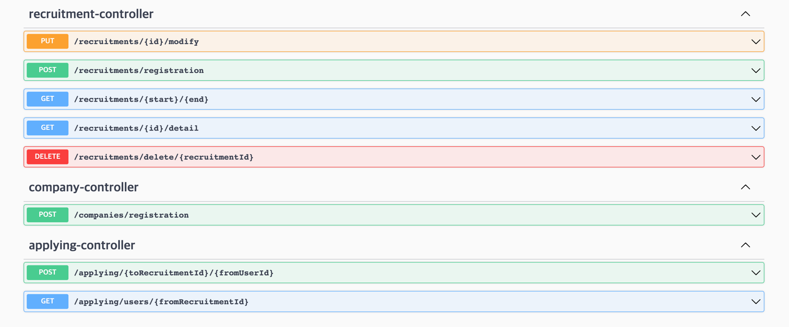
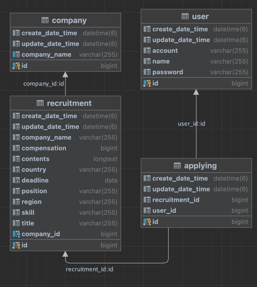

# wanted-pre-onboarding-backend
원티드 프리온보딩 백엔드 인턴쉽 사전과제

---

## 서버 사용 기술 스택

- 언어 : java
- 스킬 : springboot, mysql, jpa

---

## 요구사항

1. **채용공고를 등록합니다.**

    <aside>
    ➡️ 회사는 아래 데이터와 같이 채용공고를 등록합니다.
    </aside>
``` JSON
{
  "title": "string",
  "position": "string",
  "region": "string",
  "country": "string",
  "compensation": 0,
  "contents": "string",
  "skill": "string",
  "deadline": "2023-10-17"
}
```

2. **채용공고를 수정합니다.**
    <aside>
    ➡️ 회사는 아래 데이터와 같이 채용공고를 수정합니다.
    </aside>
``` JSON
{
  "companyId": 0,
  "title": "string",
  "position": "string",
  "region": "string",
  "country": "string",
  "compensation": 0,
  "contents": "string",
  "skill": "string",
  "deadline": "2023-10-17"
}
```
   
3. **채용공고를 삭제합니다.**

    <aside>
    ➡️ DB에서 삭제됩니다.
    </aside>

4. **채용공고 목록을 가져옵니다.**

    <aside>
    ➡️ 4-1. 사용자는 채용공고 목록을 아래와 같이 확인할 수 있습니다.
    </aside>
``` JSON
Example)
[
	{
   	  "채용공고_id": 채용공고_id,
	  "회사명":"원티드랩",
	  "국가":"한국",
	  "지역":"서울",
	  "채용포지션":"백엔드 주니어 개발자",
	  "채용보상금":1500000,
	  "사용기술":"Python"
	},
	{
	  "채용공고_id": 채용공고_id,
	  "회사명":"네이버",
	  "국가":"한국",
	  "지역":"판교",
	  "채용포지션":"Django 백엔드 개발자",
	  "채용보상금":1000000,
	  "사용기술":"Django"
	},
  ...
]
```
<aside>
    ➡️ 4-2. 채용공고 검색 기능 구현(선택사항 및 가산점요소).
</aside>

```JSON
# Example - 1) some/url?search=원티드
[
	{
      "채용공고_id": 채용공고_id,
	  "회사명":"원티드랩",
	  "국가":"한국",
	  "지역":"서울",
	  "채용포지션":"백엔드 주니어 개발자",
	  "채용보상금":1500000,
	  "사용기술":"Python"
	},
	{
      "채용공고_id": 채용공고_id,
	  "회사명":"원티드코리아",
	  "국가":"한국",
	  "지역":"부산",
	  "채용포지션":"프론트엔드 개발자",
	  "채용보상금":500000,
	  "사용기술":"javascript"
	}
]

# Example - 2) some/url?search=Django
[
	{
      "채용공고_id": 채용공고_id,
	  "회사명":"네이버",
	  "국가":"한국",
	  "지역":"판교",
	  "채용포지션":"Django 백엔드 개발자",
	  "채용보상금":1000000,
	  "사용기술":"Django"
	},
	{
      "채용공고_id": 채용공고_id,
	  "회사명":"카카오",
	  "국가":"한국",
	  "지역":"판교",
	  "채용포지션":"Django 백엔드 개발자",
	  "채용보상금":500000,
	  "사용기술":"Python"
	}
  ...
]
```

5. **채용 상세 페이지를 가져옵니다.**

    <aside>
    ➡️ 사용자는 채용상세 페이지를 아래와 같이 확인할 수 있습니다.

   - “채용내용”이 추가적으로 담겨있음.
   - 해당 회사가 올린 다른 채용공고 가 추가적으로 포함됩니다
       </aside>

``` JSON
{
  "id": 1,
  "companyName": "채용디자인",
  "position": "PM",
  "compensation": 1500000,
  "skill": "javascript",
  "deadline": "2023-10-22",
  "contents": "신규 Product 관리할 pm 구합니다. ... ",
  "otherRecruitmentIds": [
    1,
    2,
    3,
    4,
    5,
    6,
    7,
    8,
    9,
    10
  ]
}
```

6. **사용자는 채용공고에 지원합니다.**

    <aside>
    ➡️ 사용자는 채용공고에 아래와 같이 지원합니다.

   - 사용자는 1회만 지원 가능합니다.
       </aside>

``` 
url path = /applying/{toRecruitmentId}/{fromUserId}
```
---

## API 명세 (_Swagger_)


---

## 기능 구현

- [x] 회사는 채용공고를 등록할 수 있다.
- [x] 회사는 채용공고내용을 수정할 수 있다.
- [ ] 회사는 채용공고를 삭제할 수 있다.
- [x] 사용자는 채용공고에 지원할 수 있다.
- [x] 해당공고에 지원한 유저들을 볼 수 있다.
- [ ] 사용자는 채용공고 목록을 볼 수 있다.
- [ ] 채용공고 검색기능을 제공한다.

---

## ERD



---

